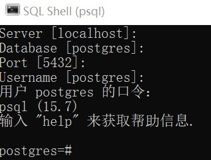
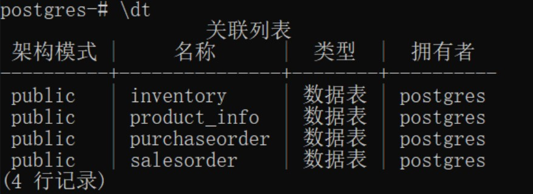

# 文件部署与执行说明

## 0. 项目部署说明

首次执行需要执行下述大步骤的1到3，后续第二次使用时，仅需要执行4即可。

## 1. 环境配置与安装

(1) 安装Python3.8或更高版本的python3

(2) 下载并配置node.js基础版本(若系统未安装Vue3，建议执行完下述完整的一、二部分)
**本项目组成员在做此实验前做脚手架实验时已经基本完成过包括此步骤的操作，所以项目组成员可以忽略步骤1(2)**

```shell
https://blog.csdn.net/m0_52861000/article/details/129127440
```

(3) 配置postgres数据库
参照 `PostgreSQL的简介与安装.pdf`，在

```shell
https://www.enterprisedb.com/downloads/postgres-postgresql-downloads
```

中安装PostgreSQL时选择的PostgreSQL版本为15.*，其余内容与教程保持一致即可。
我们这里不妨假设设置的密码为password（具体可根据需要进行修改，后续内容将password修改为实际设置的密码即可）。

(4) 安装依赖包(核心是下列安装包，如果还有缺失的库，后续根据报错进行补充安装即可)

```bash
conda install django  
pip install djangorestframework  
pip install django-cors-headers
```

其他方法：通过``back_end_and_database/your_project_name``路径下的``requirements.txt``安装依赖包
```bash
pip install -r requirements.txt
```

(5) 从github上下载src文件夹至本地路径 `$path`，并解压之。

## 2. 进入默认的postgres数据库并配置

(1) 通过终端进入postgres数据库，下面的用户postgres口令是你自己的密码


(2) 构建表格
这里将要构建下列4个表格


在命令行依次输入如下下列信息以构建表格

**Product_info表**

```pgsql
CREATE TABLE Product_info (
    product_id INTEGER PRIMARY KEY,
    product_name VARCHAR,
    specification VARCHAR,
    description TEXT,
    classification VARCHAR,
    price NUMERIC
);
```

**Inventory表**

```pgsql
CREATE TABLE Inventory (
    product_id INTEGER PRIMARY KEY REFERENCES Product_info(product_id),
    stock_quantity INTEGER
);
```

**Purchaseorder表**

```pgsql
CREATE TABLE Purchaseorder (
    order_number VARCHAR PRIMARY KEY,
    purchase_date DATE,
    unit_price NUMERIC,
    quantity INTEGER,
    supplier VARCHAR,
    received BOOLEAN,
    product_id INTEGER REFERENCES Product_info(product_id)
);

```

**Salesorder表**

```pgsql
CREATE TABLE Salesorder (
    order_number VARCHAR PRIMARY KEY,
    sales_date DATE,
    unit_price NUMERIC,
    quantity INTEGER,
    product_id INTEGER REFERENCES Product_info(product_id)
);

```

(3) 构建触发器

在命令行依次输入如下信息以创建触发器

**触发器1**

```pgsql
-- 创建触发器函数
CREATE OR REPLACE FUNCTION create_inventory_entry()
RETURNS TRIGGER AS $$
BEGIN
    INSERT INTO Inventory(product_id, stock_quantity)
    VALUES (NEW.product_id, 0);
    RETURN NEW;
END;
$$ LANGUAGE plpgsql;

-- 创建触发器
CREATE TRIGGER after_productinfo_insert_trigger
AFTER INSERT ON Product_info
FOR EACH ROW
EXECUTE FUNCTION create_inventory_entry();

```

**触发器2**

```pgsql
-- 创建或替换触发器函数
CREATE OR REPLACE FUNCTION update_inventory_after_purchase()
RETURNS TRIGGER AS $$
BEGIN
    IF TG_OP = 'INSERT' THEN
        -- 增加库存
        UPDATE Inventory
        SET stock_quantity = stock_quantity + NEW.quantity
        WHERE product_id = NEW.product_id;
    ELSIF TG_OP = 'UPDATE' THEN
        -- 更新库存（例如，如果数量发生变化）
        UPDATE Inventory
        SET stock_quantity = stock_quantity + (NEW.quantity - OLD.quantity)
        WHERE product_id = NEW.product_id;
    ELSIF TG_OP = 'DELETE' THEN
        -- 减少库存
        UPDATE Inventory
        SET stock_quantity = stock_quantity - OLD.quantity
        WHERE product_id = OLD.product_id;
    END IF;
    RETURN NEW;
END;
$$ LANGUAGE plpgsql;

-- 创建触发器
CREATE TRIGGER after_purchase_trigger
AFTER INSERT OR UPDATE OR DELETE ON Purchaseorder
FOR EACH ROW
EXECUTE FUNCTION update_inventory_after_purchase();

```

触发器3

```pgsql
-- 创建或替换触发器函数
CREATE OR REPLACE FUNCTION update_inventory_after_sale()
RETURNS TRIGGER AS $$
BEGIN
    IF TG_OP = 'INSERT' THEN
        -- 减少库存
        UPDATE Inventory
        SET stock_quantity = stock_quantity - NEW.quantity
        WHERE product_id = NEW.product_id;
    ELSIF TG_OP = 'UPDATE' THEN
        -- 更新库存（例如，如果数量发生变化）
        UPDATE Inventory
        SET stock_quantity = stock_quantity - (NEW.quantity - OLD.quantity)
        WHERE product_id = NEW.product_id;
    ELSIF TG_OP = 'DELETE' THEN
        -- 增加库存（在删除销售订单时，相当于撤销销售）
        UPDATE Inventory
        SET stock_quantity = stock_quantity + OLD.quantity
        WHERE product_id = OLD.product_id;
    END IF;
    RETURN NEW;
END;
$$ LANGUAGE plpgsql;

-- 创建触发器
CREATE TRIGGER after_sale_trigger
AFTER INSERT OR UPDATE OR DELETE ON Salesorder
FOR EACH ROW
EXECUTE FUNCTION update_inventory_after_sale();

```

## 3. 后端配置

(1) 修改 `src\back_end_and_database\your_project_name\your_project_name`路径下 `settings.py`文件；

```python
...
DATABASES = {
    'default': {
        'ENGINE': 'django.db.backends.postgresql',
        'NAME': 'postgres',
        'USER': 'postgres',
        'PASSWORD': 'password', # 这里是你的数据库密码
        'HOST': 'localhost',
        'PORT': '5432',
    }
}
...
```

## 4. 启动操作

(1) 通过打开PostgreSQL数据库（输入用户名及相应口令，这里默认是仅需要输入用户postgres口令，其它部分按enter跳过即可），而后输入 `\dt`应该能看到与2(2)中相同的表格信息。  
(2) 再新建一个终端，进入 `$path\src\back_end_and_database\your_project_name`路径，输入如下命令以启动**后端**服务：
```shell
python manage.py runserver
```  
(3) 再新建一个终端进入 `$path\src\front_end`路径，输入如下命令以启动**前端**服务：
```shell
npm run dev
```
记录下前端服务的端口号，这里假定为5173。  
(4) 打开浏览器，输入 `http://localhost:5173/` 即可看到前端页面。
