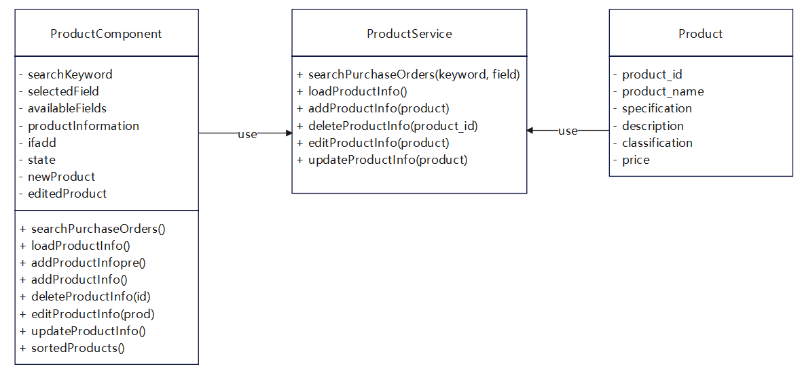
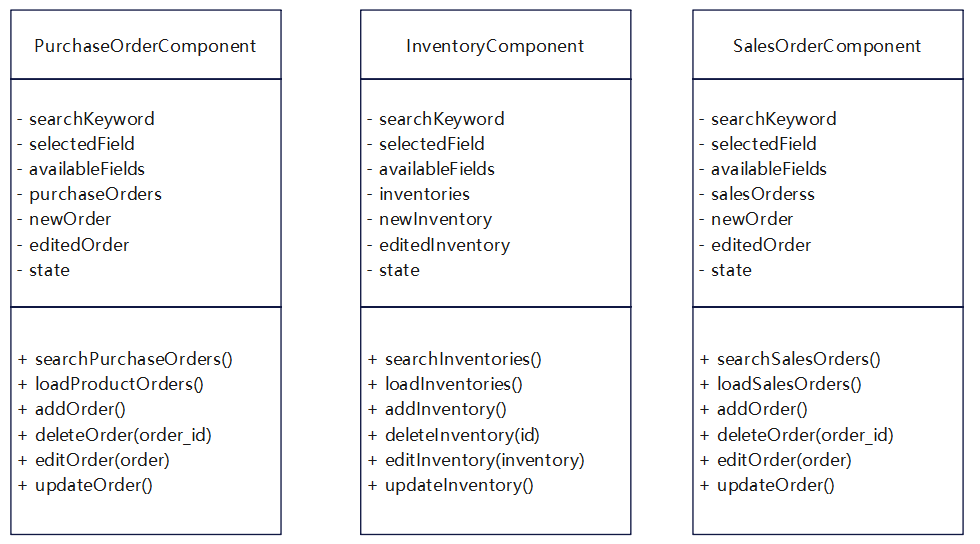
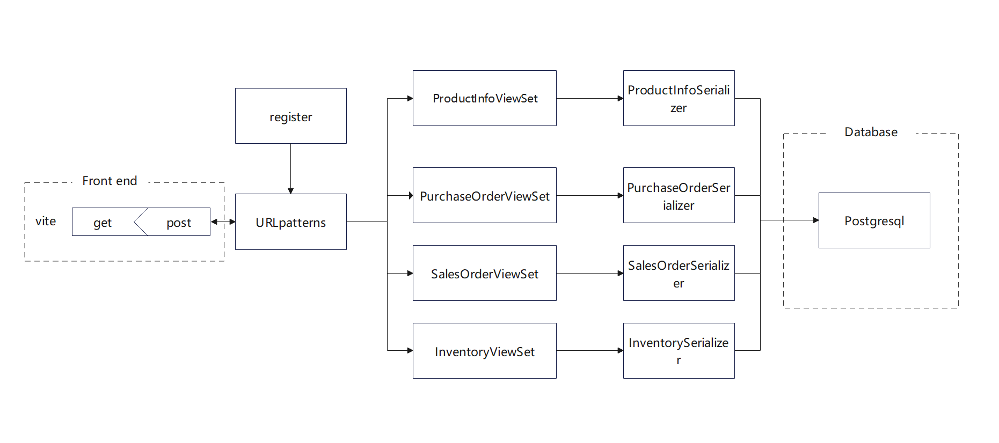
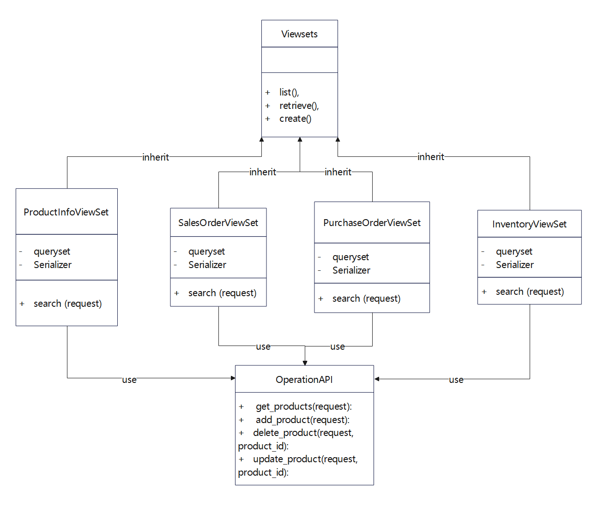
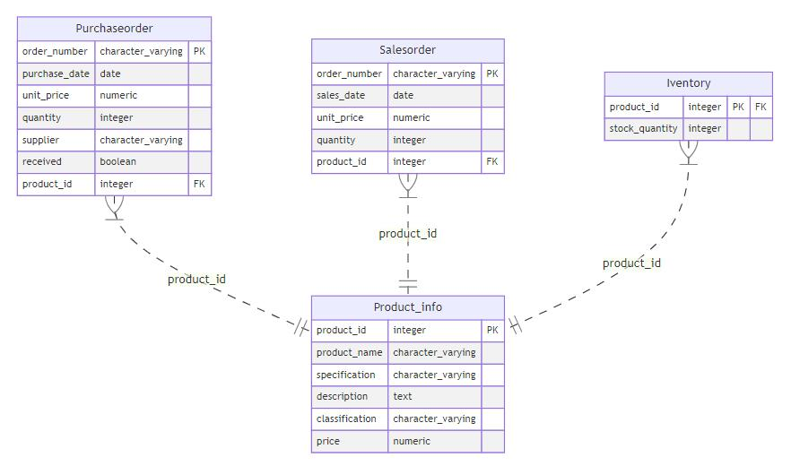

## 架构设计文档

### 0. 特别说明

此处仅仅展示了核心代码部分，具体代码实验见src文件夹。

### 1. 总体架构


超市仓储管理系统的整体架构设计图如上所示，大致分为三个部分vite前端，Django后端，Postgresql数据库。

* vite前端：主要符合和用户进行交互，其主要的功能有主界面，采购订单，商品信息，销售订单以及库存这五大板块。如架构图所示，其中后四项内部包含增删改查等多种功能，并通过URL向后端传输指令并从后端获取返回来的信息。
* Django后端：从前端接受指令后会对其进行解析，并映射到相应的视图函数，通过在Django内定义与Postgresql数据库相匹配的数据类型来将视图函数的指令转换成SQL查询，从而与Postgresql进行交互。
* Postgresql数据库：主要包含产品信息表，交易订单表，采购订单表以及库存信息表。通过查询语句和触发器与后端进行交互，从而进行表格的增删改查。

### 2. 技术栈选择

#### 2.1 前端技术栈选择：vite

- **速启动和即时热更新**：Vite 的核心优势之一是其极快的启动速度和高效的热模块替换。这是因为 Vite 利用了现代浏览器原生支持的 ES 模块系统，而不是像传统工具那样捆绑所有文件再启动服务器。
- **现代浏览器支持和简洁配置**：Vite充分利用了现代浏览器对ES模块的支持，减少了对传统构建步骤的依赖，从而加快了构建速度。同时，Vite的配置非常简洁，开箱即用，开发者可以迅速上手。
- **丰富的插件生态**：Vite有一个强大的插件系统和一个活跃的社区，这使得开发者可以方便地扩展其功能，并获得良好的支持和资源。Vite的插件系统基于Rollup的插件模型，因此可以直接使用大量现有的Rollup插件。此外，Vite社区也开发了许多专门针对Vite的插件，涵盖了从CSS预处理器支持到图像优化、环境变量注入等各种功能需求。开发者可以通过简单的配置引入这些插件，极大地提升开发效率。

#### 2.2 后端技术框架选择：Django

- **高效的开发速度**：Django包含了许多内置的功能和工具，这些工具能够极大地加快开发过程。例如，Django自带的管理后台自动生成数据管理界面，开发者不需要为每个模型手动编写CRUD（创建、读取、更新、删除）操作。同时，Django的ORM（对象关系映射）允许开发者使用Python代码来操作数据库，而不是直接编写SQL，这不仅减少了代码量，还降低了出错的可能性。
- **内置的安全功能**：Django内置了多种安全保护措施，包括防止SQL注入、跨站脚本攻击（XSS）、跨站请求伪造（CSRF）等常见的Web攻击。
  （1） SQL注入防护：Django的ORM会自动处理用户输入的数据，从而防止SQL注入攻击。开发者无需手动转义和验证SQL查询中的参数。
  （2） 跨站脚本攻击防护：Django的模板系统会自动转义输出到HTML的所有变量，防止恶意代码注入。
  （3） 跨站请求伪造防护：Django提供了CSRF中间件，自动为表单添加CSRF令牌，从而确保表单提交的请求是从可信的源发出的。
  这些内置的安全特性使得Django成为构建安全Web应用的理想选择，开发者可以专注于实现应用功能，而不需要额外担心安全问题。

#### 2.3 数据库技术框架选择：Postgresql

- **高度的可靠性和数据完整性**：PostgreSQL在设计上非常注重数据完整性和事务处理，支持ACID（原子性、一致性、隔离性、持久性）事务。这意味着所有的数据库操作要么全部成功，要么全部失败，确保数据始终处于一致的状态。此外，PostgreSQL还支持多版本并发控制，允许多个事务同时进行而不会相互干扰，从而提高了并发性能和系统的可靠性。
- **强大的扩展性**：PostgreSQL的扩展性体现在它支持用户自定义功能的能力上。开发者可以根据需要创建自定义数据类型、函数、操作符和索引，甚至可以编写自定义扩展模块。这使得PostgreSQL能够灵活适应各种复杂的业务需求。

### 3. 前端架构设计


通过前端登录（注册），加载进入浏览器的页面，页面中包含了五个板块，分别是主界面，采购订单，商品信息，销售订单以及库存。在这五个板块中，用户可以进行增删改查等多种操作。用户通过点击页面上的按钮，输入框等与页面交互；如果是对产品数量或产品类型进行编辑操作，将触发Vue组件中的相应方法。Vue组件中的方法使用Axios发送HTTP请求到后端API节点。相应信息将通过router传递到对应组件中。此前端生成的router和后端router相联系与对应。

#### 3.1 Browser&Login核心部分设计：

以下部分为注册和登录部分的代码,两个模块结构相似:

```javascript
    <!-- login form -->
      <el-form v-if="isLoginForm" @submit.prevent="handleLogin" method="post">
        <el-label for="username">用户名:</el-label>
        <input type="text" id="username" v-model="username" required><br/>

        <el-label for="password">密码:</el-label>
        <input type="password" id="password" v-model="password" required><br/>

        <el-button color="#626aef" :dark="isDark" type="primary" @click="handleLogin">登录</el-button>
        <p v-if="errorMessage !== ''" style="color: red;">{{ errorMessage }}</p>
        <p>没有账号？<span @click="toggleForm" class="toggle-link">注册</span></p>
      </el-form>

      <!-- register form -->
      <el-form v-else @submit.prevent="handleRegister" method="post">
        <el-label for="registerUsername">用户名:</el-label>
        <input type="text" id="registerUsername" v-model="registerUsername" required><br/>

        <el-label for="registerPassword">密码:</el-label>
        <input type="password" id="registerPassword" v-model="registerPassword" required><br/>

        <el-label for="confirmPassword">确认密码:</el-label>
        <input type="password" id="confirmPassword" v-model="confirmPassword" required><br/>

        <el-button color="#626aef" :dark="isDark" type="primary" @click="handleRegister">注册</el-button>
        <p v-if="errorMessage !== ''" style="color: red;">{{ errorMessage }}</p>
        <p>已有账号？<span @click="toggleForm" class="toggle-link">登录</span></p>
      </el-form>
```

它用到了单例模式的思想（这里虽然没有直接体现单例模式，但是在Vue组件的上下文中，Vue实例（此处登录或注册的实例）可以被看作是一个单例。Vue实例负责管理组件的状态和行为，并确保所有组件共享相同的数据和方法）。

#### 3.2 前端views模块（内部有包含Model）：

具体对应上述views整体模块的UML图，共计4个部分，依次对应下述组件（名称略有修改，整体框架图名称以简略为目的，此处即细节化）：



#### 3.3 URLs模块

- 构建router并导出为默认router，以供后端使用(front_end/src/router/index.js)：

```js
const router = createRouter{
    ...
}
```

- 确定导出的目的32位IP地址和端口，以配合router一起将数据传递到后端。
  (这里需要配合views里的部分方法，以PurchaseOrder为例，抽取其中的地址。front_end/src/views/PurchaseOrder.vue)：

```js
export default{
    ...
    methods:{
        loadPurchaseOrders() {
        }
        ...
    }
}
```

- 调用router(front_end/src/main.js)：

```js
const app = createApp(App)
app
.use(router)
.use(ElementUI)
.use(ElementPlus)
.mount('#app')
```

- 此部分使用了模块化模式，高度提升了代码的可维护性和可读性。当然，也有使用描述接口。
- 而且也有使用异步请求回调模式,例如下面所示（此处仅仅展示部分内容，具体参见源代码front_end/src/views/PurchaseOrder.vue）
  - 异步请求：`axios.get('http://127.0.0.1:8000/your_app_name/api/purchase-orders/')`
  - 回调函数中异步请求成功：`.then(response => {     ... })`
  - 回调函数中异步请求失败：`.catch(error => {console.error('Error:', error);});`

### 4.后端架构设计



从前端接收到指令后经由提前注册好的URLpattern解析并根据指令要求跳转到图中的view函数，在view函数中会使用Serializer序列器对从数据库中取出的数据进行格式转换，转成成类似于Json等方便传输的格式进行返回，使得前端拿到结果。

#### 4.1 URLs模块

该模块主要用于注册视图集，解析前端发出的指令，并将指令要求映射到对应的视图函数中。

使用router.register对如下四个视图集进行注册：

```python
router.register(r'purchase-orders', PurchaseOrderViewSet, basename='purchase-order')
router.register(r'sales-orders', SalesOrderViewSet, basename='sales-order')
router.register(r'inventories', InventoryViewSet, basename='inventory')
router.register(r'product-info', ProductInfoViewSet, basename='product-info')
```

构建urlpatterns映射表：

```python
urlpatterns = [
    path('api/products/', get_products, name='get_products'),
    path('api/products/add', add_product, name='add_product'),
    path('api/products/<int:product_id>/', delete_product, name='delete_product'),
    path('api/products/<int:product_id>/update/', update_product, name='update_product'),
    path('api/', include(router.urls)),
    path('api/ProductInfo/',ProductInfoAPI.as_view(),name='ProductInfoAPI')
]
```

根据URL请求的种类匹配对应的视图函数。

#### 4.2 视图集函数



该系统旨在管理产品信息、采购订单、销售订单以及库存数据。系统提供了一系列的API，用于对上述各类数据进行增删改查操作，并支持基于指定字段进行模糊查询。主要涉及的模型有 `Product`, `Product_info`, `PurchaseOrder`, `SalesOrder`, 和 `Inventory`。
**接口设计**
定义基础操作的API接口

```python
@api_view(['GET'])
def get_products(request):

@api_view(['POST'])
def add_product(request):

@api_view(['DELETE'])
def delete_product(request, product_id):

@api_view(['PUT'])
def update_product(request, product_id):
```

定义高层模型API，用于针对不同的表格应用基础操作的API接口。

```python
class ProductInfoViewSet(viewsets.ModelViewSet):
    queryset = Product_info.objects.all() 
    serializer_class = ProductInfoSerializer

    @action(detail=False, methods=['GET'])
    def search(self, request):
        # 获取查询参数，例如产品名称
        query = request.GET.get('query', '')
        field = request.GET.get('field', 'product_id')
        # 使用icontains进行模糊查询
        if field not in [field.name for field in Product_info._meta.get_fields()]:
            return Response({'error': 'Invalid field specified'}, status=400)

        filter_kwargs = {f'{field}__icontains': query}
        results = Product_info.objects.filter(**filter_kwargs)
        serializer = self.get_serializer(results, many=True)
        return Response(serializer.data)
```

产品信息表视图集，调用GET函数，用于获取所有产品信息的列表。

同理类似的格式，可以针对其他表格建立视图集：

```python
class PurchaseOrderViewSet(viewsets.ModelViewSet):
    queryset = PurchaseOrder.objects.all() 
    serializer_class = PurchaseOrderSerializer

    @action(detail=False, methods=['GET'])
    def search(self, request):
	...

class SalesOrderViewSet(viewsets.ModelViewSet):
    queryset = SalesOrder.objects.all()
    serializer_class = SalesOrderSerializer

    @action(detail=False, methods=['GET'])
    def search(self, request):
	...

class InventoryViewSet(viewsets.ModelViewSet):
    queryset = Inventory.objects.all()
    serializer_class = InventorySerializer

    @action(detail=False, methods=['GET'])
    def search(self, request):
	...
```

#### 4.3 Model模块

model类定义了数据库中各个表的结构，并确保了数据的一致性和完整性，同时提供了方便的查询和管理接口。

Product_info

```python
class Product_info(models.Model):
    # product_id = models.AutoField(primary_key=True)
    product_id = models.IntegerField(primary_key=True, unique=True)
    product_name = models.CharField(max_length=255)
    specification = models.CharField(max_length=255)
    description = models.TextField()
    classification = models.CharField(max_length=50)
    price = models.DecimalField(max_digits=10, decimal_places=2)
```

PurchaseOrder

```python
class PurchaseOrder(models.Model):
    order_number = models.CharField(max_length=50, primary_key=True)
    product_id = models.ForeignKey('Product_info', on_delete=models.CASCADE,db_column='product_id')
    purchase_date = models.DateField()
    unit_price = models.DecimalField(max_digits=10, decimal_places=2)
    quantity = models.PositiveIntegerField()
    supplier = models.CharField(max_length=100)
    received = models.BooleanField(default=False)
```

SalesOrder

```python
class SalesOrder(models.Model):
    order_number = models.CharField(max_length=50, primary_key=True)
    product_id = models.ForeignKey('Product_info', on_delete=models.CASCADE,db_column='product_id')
    sales_date = models.DateField()
    unit_price = models.DecimalField(max_digits=10, decimal_places=2)
    quantity = models.PositiveIntegerField()
```

Inventory

```python
class Inventory(models.Model):
    product_id = models.OneToOneField('Product_info', on_delete=models.CASCADE, primary_key=True,db_column='product_id')
    stock_quantity = models.PositiveIntegerField()
```

### 5.数据库架构设计



#### 5.1 表格信息

**Product_info**

* `product_id`: 整数型，主键
* `product_name`: 字符串，最大长度 255
* `specification`: 字符串，最大长度 255
* `description`: 文本
* `classification`: 字符串，最大长度 50
* `price`: 十进制数，最大长度 10 位，2 位小数

**PurchaseOrder**

* `order_number`: 字符串，最大长度 50，主键
* `product_id`: 外键，关联到 `Product_info` 表的 `product_id`
* `purchase_date`: 日期型
* `unit_price`: 十进制数，最大长度 10 位，2 位小数
* `quantity`: 正整数
* `supplier`: 字符串，最大长度 100
* `received`: 布尔型，默认值 `False`

**SalesOrder**

* `order_number`: 字符串，最大长度 50，主键
* `product_id`: 外键，关联到 `Product_info` 表的 `product_id`
* `sales_date`: 日期型
* `unit_price`: 十进制数，最大长度 10 位，2 位小数
* `quantity`: 正整数

**Inventory**

* `product_id`: 一对一外键，关联到 `Product_info` 表的 `product_id`
* `stock_quantity`: 正整数

#### 5.2 触发器设计

```pgsql
CREATE OR REPLACE FUNCTION create_inventory_entry()
RETURNS TRIGGER AS $$
BEGIN
    INSERT INTO Inventory(product_id, stock_quantity)
    VALUES (NEW.product_id, 0);
    RETURN NEW;
END;
$$ LANGUAGE plpgsql;

-- 创建触发器
CREATE TRIGGER after_productinfo_insert_trigger
AFTER INSERT ON Product_info
FOR EACH ROW
EXECUTE FUNCTION create_inventory_entry();
```

这个触发器的作用是确保每次添加新的产品信息时，自动在库存表中创建对应的库存记录，并将库存数量初始化为 0。

```pgsql
CREATE OR REPLACE FUNCTION update_inventory_after_purchase()
RETURNS TRIGGER AS $$
BEGIN
    IF TG_OP = 'INSERT' THEN
        -- 增加库存
        UPDATE Inventory
        SET stock_quantity = stock_quantity + NEW.quantity
        WHERE product_id = NEW.product_id;
    ELSIF TG_OP = 'UPDATE' THEN
        -- 更新库存（例如，如果数量发生变化）
        UPDATE Inventory
        SET stock_quantity = stock_quantity + (NEW.quantity - OLD.quantity)
        WHERE product_id = NEW.product_id;
    ELSIF TG_OP = 'DELETE' THEN
        -- 减少库存
        UPDATE Inventory
        SET stock_quantity = stock_quantity - OLD.quantity
        WHERE product_id = OLD.product_id;
    END IF;
    RETURN NEW;
END;
$$ LANGUAGE plpgsql;

-- 创建触发器
CREATE TRIGGER after_purchase_trigger
AFTER INSERT OR UPDATE OR DELETE ON Purchaseorder
FOR EACH ROW
EXECUTE FUNCTION update_inventory_after_purchase();
```

此触发器确保了库存数量始终与采购订单的状态同步，无论是新增、更新还是删除采购订单记录。通过这种方式，库存数据始终保持最新。

```pgsql
CREATE OR REPLACE FUNCTION update_inventory_after_sale()
RETURNS TRIGGER AS $$
BEGIN
    IF TG_OP = 'INSERT' THEN
        -- 减少库存
        UPDATE Inventory
        SET stock_quantity = stock_quantity - NEW.quantity
        WHERE product_id = NEW.product_id;
    ELSIF TG_OP = 'UPDATE' THEN
        -- 更新库存（例如，如果数量发生变化）
        UPDATE Inventory
        SET stock_quantity = stock_quantity - (NEW.quantity - OLD.quantity)
        WHERE product_id = NEW.product_id;
    ELSIF TG_OP = 'DELETE' THEN
        -- 增加库存（在删除销售订单时，相当于撤销销售）
        UPDATE Inventory
        SET stock_quantity = stock_quantity + OLD.quantity
        WHERE product_id = OLD.product_id;
    END IF;
    RETURN NEW;
END;
$$ LANGUAGE plpgsql;

-- 创建触发器
CREATE TRIGGER after_sale_trigger
AFTER INSERT OR UPDATE OR DELETE ON Salesorder
FOR EACH ROW
EXECUTE FUNCTION update_inventory_after_sale();
```

1. 当插入新销售订单时 (INSERT)：
   - update_inventory_after_sale 函数会执行 UPDATE Inventory，将相应产品的库存数量减少 NEW.quantity。
2. 当更新销售订单时 (UPDATE)：
   - 函数会计算 NEW.quantity - OLD.quantity，然后更新 Inventory 表中相应产品的库存数量，确保库存数量正确。
3. 当删除销售订单时 (DELETE)：
   - 函数会将 OLD.quantity 加回库存数量，相当于撤销销售订单，恢复相应产品的库存数量。
