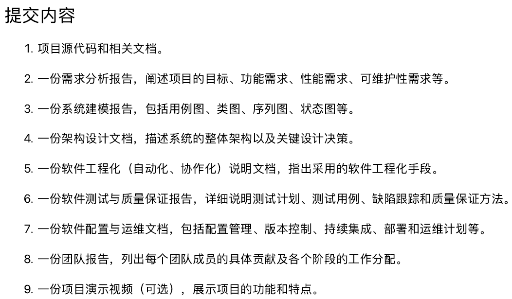

# 团队报告

## 0. 内容概述与其它说明

    此部分内容包括各个团队成员具体贡献与各个阶段的工作分配，同时还包括任务分配相关的协调文档和使用的工具等。
    此次实验中，初始任务分配尽可能保证了任务量平均化，虽然有团队成员表现出了更高的积极度。但所有团队成员都积极与认真地参与完成了此项目，大家交流沟通密切。

## 1. 团队成员信息

| 姓名           | 学号     |
| -------------- | -------- |
| 张序（负责人） | 21307162 |
| 张彦博         | 21307294 |
| 杨子昂         | 21307181 |
| 陈欣宇         | 21307347 |
| 高宇           | 21307350 |
| 陈华清         | 21307100 |

## 2. 项目内容

(1) 项目代码构建

* 获取源代码
* 对源代码进行改进（修复界面操作bug等）与优化升级（添加新的注册表，更换界面图片）

(2) 撰写各个设计文档

## 3. 各个团队成员具体贡献

(1) 张序：

(2) 张彦博：

(3) 杨子昂：

(4) 陈欣宇：

(5) 高宇：

(6) 陈华清：

## 4. 各个阶段任务分工

此处借鉴了少量Scrum Sprint Backlog的方法以及其它软件过程管理的方法。

(1) 第一阶段（5.13-5.27）

* 需求分析文档撰写（张序）
* 源代码查找与初始部署文档的提供（张彦博）
* 基础代码调整 + 可部署于个人设备上架构文档的撰写（杨子昂）

(2) 第二阶段（5.28-6.5）

* 尝试部署项目（全部团队成员）
* 项目内容上代码的调试，思考并尝试可能的创新点（全部团队成员）

(3) 第三阶段（6.6-6.22）

* 完成各自的项目报告（全部团队成员）
* 在有余力的前提下，对其它项目报告进行优化（全部团队成员）

(4) 第四阶段（6.20-6.25）

* 撰写项目汇报ppt
* 项目报告的最终优化（全部团队成员）

## 5. 协同完成任务情况记录：

(1) 渠道1：微信（内容过多，如需备调，可联系张序查找）

(2) 任务说明与完成情况记录
[https://docs.qq.com/sheet/DRm9kd1NVQnZVYnFi?tab=BB08J2]()

(3) 线下会议：至少5次（内容过多，如需备调，可联系张序查找）
