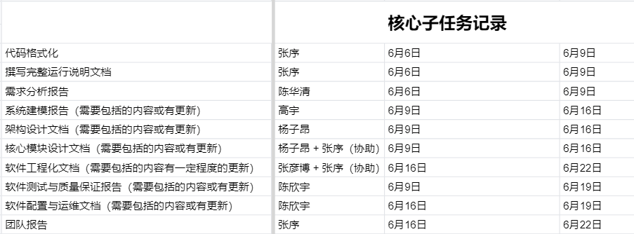
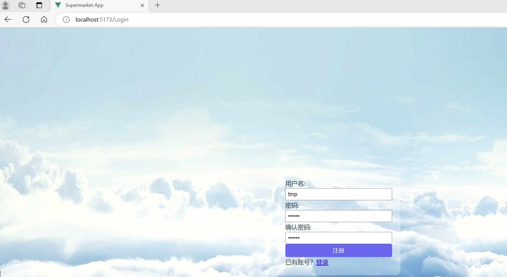
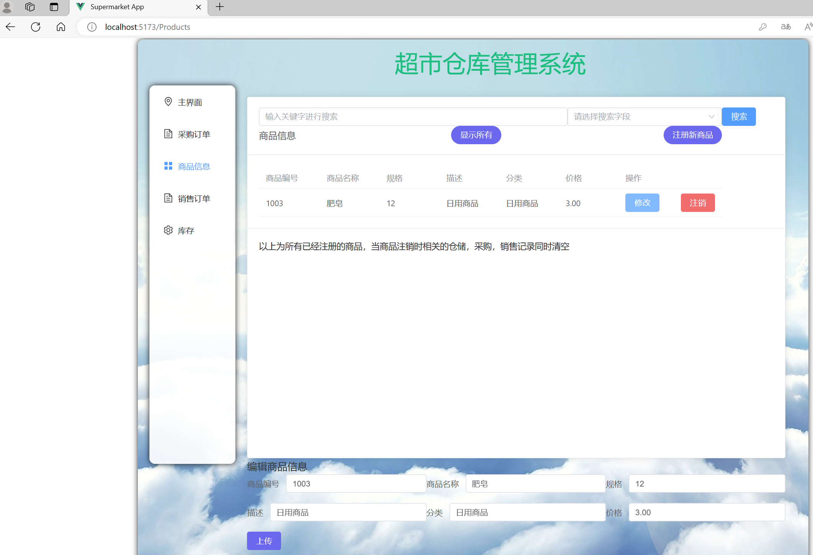
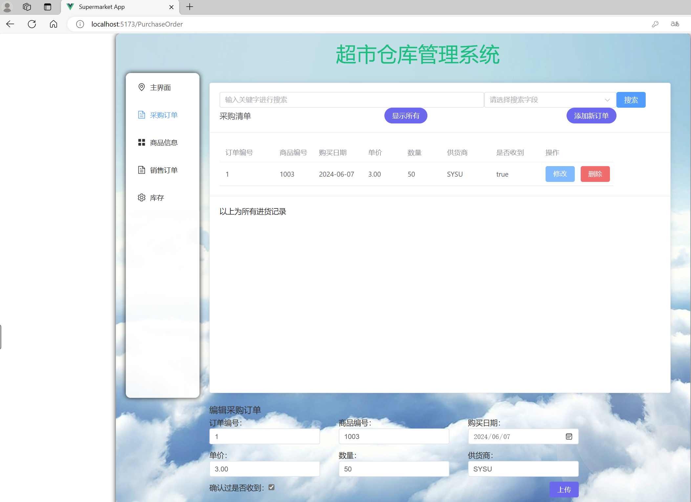
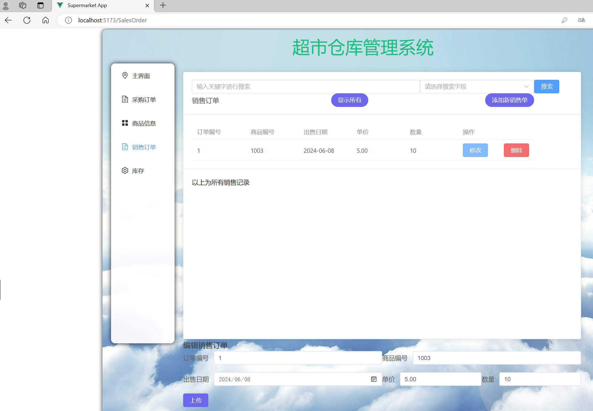
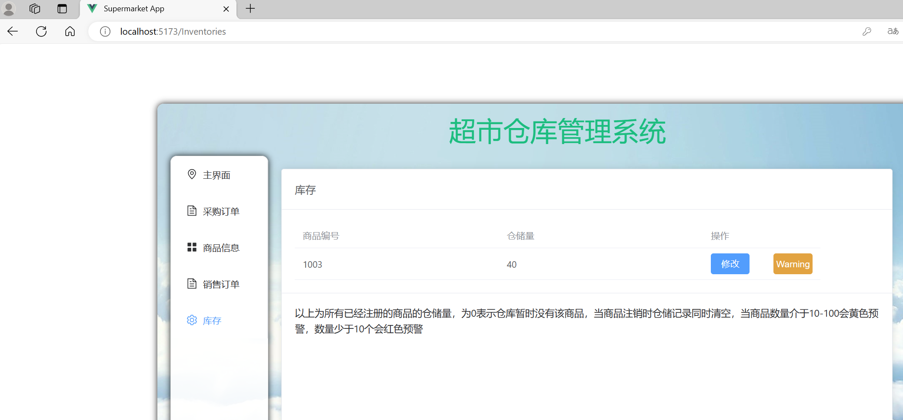

# 结题综述

## 1. 项目背景

(1) 项目概述与目标

本项目设计之初，旨在开发一个可以存储商品信息，并便于管理员增删信息，且用户得以方便访问商品内指定商品情况的超市库管理系统。后续由于需求变化，项目内容转向至报告设计文档等。

(2) 项目的预期成果

* 建立可进行用户登录、注册与进行商品增删操作的超市库管理系统，且具有一定的界面美观度与操作性。
* 完成各个设计文档的撰写，包括但不限于需求分析报告、架构设计文档、系统建模报告、软件测试与质量保证报告、软件配置与运维文档、软件过程管理文档、软件工程化文档、团队报告等。

## 2. 项目实施过程

(1) 项目宏观进度

* 第一阶段（5.13-5.27）
  * 需求分析文档撰写
  * 源代码查找与初始部署文档的提供
  * 基于已有骨架进行前后端内容的完善（全部团队成员）
  * 代码内容丰富
  * 可部署于个人设备上架构文档的撰写
* 第二阶段（5.28-6.10）
  * 尝试部署项目（全部团队成员）
  * 项目内容上代码的调试，思考并尝试可能的创新点（全部团队成员）
* 第三阶段（6.6-6.22）
  * 完成各自的项目报告（全部团队成员）
  * 在有余力的前提下，对其它项目报告进行优化（全部团队成员）
* 第四阶段（6.20-6.25）
  * 撰写项目汇报ppt（全部团队成员）
  * 项目报告的最终优化（全部团队成员）

(2) 关键实施步骤与方法

* 前期代码部分是使用的是最原始的微信直接文件传输的方式，后期改为GitHub操作
  * 体现了从原始文件传输方式向版本控制系统的转变。
  * **软件工程方法**：版本控制管理
* 使用GitHub里Git Bash进行协同报告任务完成与内容更新
  * 通过GitHub和Git Bash进行协同工作和内容更新，这代表了团队协作中的持续集成和持续交付的实践。这些方法通过频繁地提交代码并自动化构建和测试流程，确保代码库的稳定性和可用性。
  * **软件工程方法**：持续集成与持续交付
* 腾讯文档中借鉴了Scrum Sprint Backlog的方法，进行任务完成情况记录
  * 方便地记录和跟踪任务完成情况，确保团队成员对任务状态有清晰的了解。
  * **软件工程方法**：Scrum
* 将任务量化，分工；并循环交替检查各个文档报告
  * 量化任务有助于更好地规划和跟踪进度，而定期检查则是确保质量和进度的关键。
  * **软件工程方法**：任务分解与持续改进
* 在完成项目报告相关文档时，有严格的时间限制，任务分配一环扣一环（如系统建模报告需要在需求分析报告后完成等）
  
  * 此场景下，任务已固定，变化较少，且时间要求紧迫。每个阶段都有明确的目标与任务。
  * **软件工程方法**：非常类似瀑布模型。

## 3. 项目成果

(1) 软件项目实现的功能与特点

* 注册与登录：用户可以注册账号并登录到指定网页
* 商品信息管理：
  * 从商品信息界面进入，注册新的商品
  * 通过采购订单界面添加新订单，增加商品信息
  * 从销售订单进入，增删销售单，改变商品库存
  * 进入库存界面，查找商品剩余仓储量

(2) 软件项目核心技术细节：

* 前端：使用Vue.js框架开发，实现了前端页面的设计与交互
* 后端：PostgreSQL数据库存储数据，Django框架实现后端逻辑
* 部署：直接部署方法

(3) 软件项目部分项目展示：

* 注册&登录界面
  
* 商品信息界面
  
* 采购订单界面
  
* 销售订单界面
  
* 库存界面
  

(4) 报告文档：

**包括内容如下**

* 结题综述
* 项目源代码对应的执行指南文档
* 软件工程化说明文档
* 需求分析报告
* 系统建模报告
* 架构设计文档（内置核心模块设计文档）
* 软件工程化说明文档
* 软件测试与质量保证报告
* 软件配置与运维文档
* 团队报告

## 4. 项目管理与团队协作

(1) 项目管理工具与测试工具使用（包括但不限于）

* Git Bash
* PyCharm
* k6
  ...

(2) 团队协作

* 团队采用GitHub进行文档项目管理，微信与线下会议进行沟通，腾讯文档等确定任务完成情况（内置有类似Scrum的任务记录工具）。
* 大家定期召开项目会议，并轮回检查其它人的文档报告与项目等，确保团队成员之间的信息同步和高效协作。

## 5. 项目评估与测试

(1) 评估标准与方法

* 评估标准
  * 测试软件系统的功能是否完整有效、性能是否达标
  * 用户功能：检查用户的注册和登录功能是否有效
  * 数据功能：检查商品信息、采购订单、销售订单、库存四个模块的增删改查功能是否完善；各模块的商品信息是否具有一致性。
* 测试方法
  此项目测试以功能验证为主，将使用更加简便快捷的黑盒测试对模块功能集成测试。

(2) 测试结果总结

* 登录与注册测试符合预期，实现预期功能。
* 新增功能：
  * 注册商品信息：库存增加会增加对应商品编号的商品；测试均符合预期。
  * 采购订单：增加库存时，会增加相应库存；测试均符合预期。
  * 销售订单：新增销售订单会根据订单中商品的数量而减少库存中对应商品的仓储量；在 `添加成功`时库存都减少对应商品销售数量，大部分测试符合预期。
* 删除功能：
  * 商品信息：所有模块中该商品的信息都会一并删除；测试均符合预期。
  * 采购订单：删除采购订单，库存对应商品的数量会根据删除的数量而发生同样数量减少；测试均符合预期。
  * 销售订单：删除销售订单，库存对应商品的数量会根据删除数量而发生同样数量增加；测试均符合预期。
* 修改功能：
  * 商品信息：构造采购订单、销售订单等；测试均符合预期。
  * 采购订单：修改商品数量，库存对应商品的数量会根据修改数量变化而发生同样变化；测试基本符合预期。
  * 销售订单：构造测试用例(T01~T35前提下进行，即已存在商品1和商品3信息、一份商品1采购订单和一份商品1销售订单)；测试基本符合预期。
* 查找功能：
  * 商品信息：选择搜索关键字，输入搜索信息，点击搜索筛选出商品信息，而后点击显示所有按钮重新看到所有商品信息；测试均符合预期。
  * 采购订单：新增采购订单后搜索关键字后可以查到新增的采购订单；测试均符合预期。
  * 销售订单：新增销售订单后搜索关键字后可以查到新增的销售订单；测试均符合预期。
* 性能测试：
  使用工具k6对整个项目进行综合性能测试，运行以下脚本，模拟大量用户访问，监控系统性能。

## 6. 遇到问题与解决方案：

(1) 挑战&解决方案1(来自张序)

* 问题描述：丰富与升级前端登陆界面时，遇到技术难题，缺乏实现之的经验。
* 解决方法：上网查找Vue.js前端编写方法并针对性地实施应用。
* 效果：
  

(2) 挑战&解决方案2(来自张序)

* 问题描述：启动项目时，原本没有各模块细化分值，已开始做项目后方有细化各部分分数占比，导致各个人负责项目所占总的分值不同，导致任务分配不均。
* 解决方法：调动全组成员积极参与任务的同时让大家交叉完成任务，实现跨模块任务协作。
* 效果：任务分配更加平均；团队成员对其它模块也有所学习与研究；内容更符合要求且丰富

(3) 挑战&解决方案3(来自杨子昂)

* 问题描述：Django框架与数据库交互时会自动隐式地添加字段，导致对数据库的存取数据失败。
* 解决方法：查询Django使用方法，使用beta函数显式定义表头字段。

(4) 挑战&解决方案4(来自张彦博)

* 问题描述：刚搭建好的系统在操作不当的情况下会出现数据对不上的情况。
* 解决方法：通过触发器来控制表格之间的逻辑关系。

(5) 挑战&解决方案5(来自陈华清)

* 问题描述：对该软件项目进行需求分析时由于经验不足不了解用户的真正需求和功能是什么。
* 解决方法：通过上网查询相关资料，查看其他类似软件和结合自身对超市和用户的了解来分析需求。

(6) 挑战&解决方案6(来自高宇)

* 问题描述：在系统建模时，需要保证各个模型之间的一致性和准确性，避免模型中存在逻辑或信息上的矛盾。
* 解决方法：由高层向低层建模，先构造框架，再细化，最后仔细检查各模型正确性。

(7) 挑战&解决方案7（来自陈欣宇）

* 问题描述：在系统建模时，需要保证各个模型之间的一致性和准确性，避免模型中存在逻辑或信息上的矛盾。
* 解决方法：由高层向低层建模，先构造框架，再细化，最后仔细检查各模型正确性。

## 7. 项目总结与展望

(1) 完成内容汇总

* 在给定骨架下，进行了前后端内容的完善补充，同时有修改部分功能，使项目代码具备了超市库管理系统的预设功能。代码量大于5000行。同时配备了执行说明。
* 基于要求，较精细化地完成了所需的文档报告。
* 项目配备有演示视频和ppt

(2) 反思

* 本项目在代码完成过程中，没有使用迭代开发工具。后续在项目开发中，可以尝试其它项目代码管理工具，以使得项目开发更加高效。
* 可以尝试更多的软件过程方面的工具，以提升软件开发等的效率。

(3) 未来计划与展望

* 如果条件允许，力求对项目进行更多的功能完善，以使项目的内容更丰富且具备更强的可部署性：
  * 将代码部署到云端
  * 查找与修复潜在的bug
